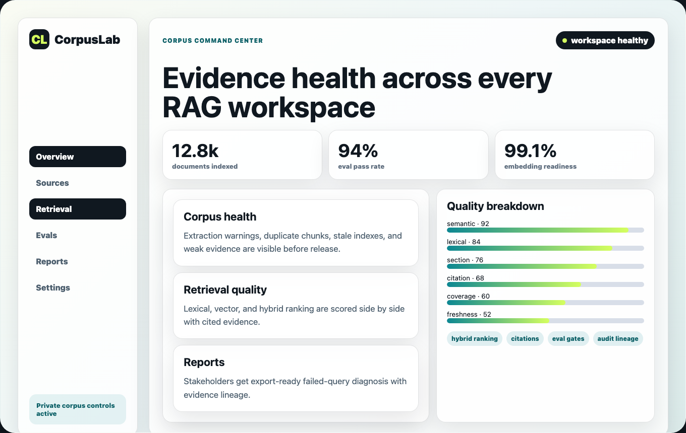
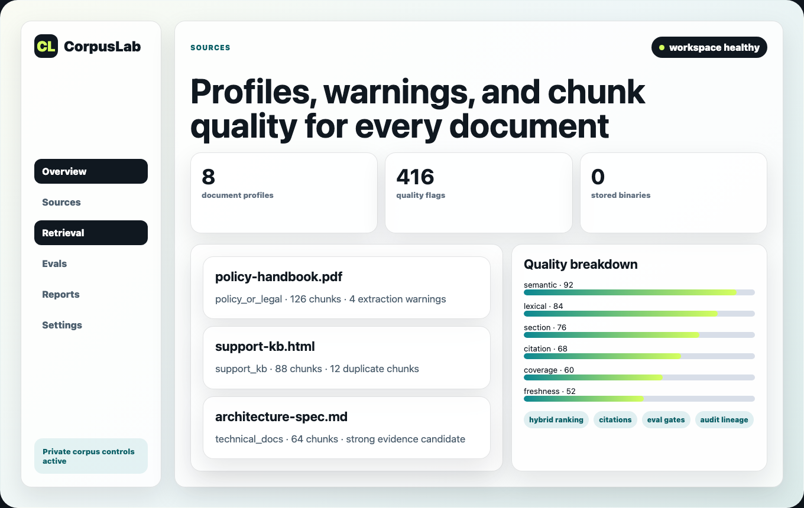
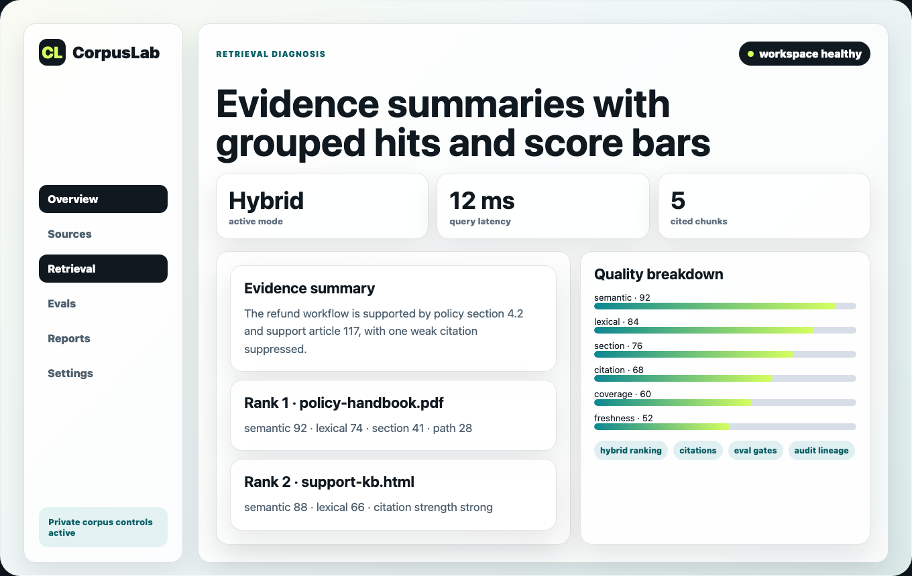
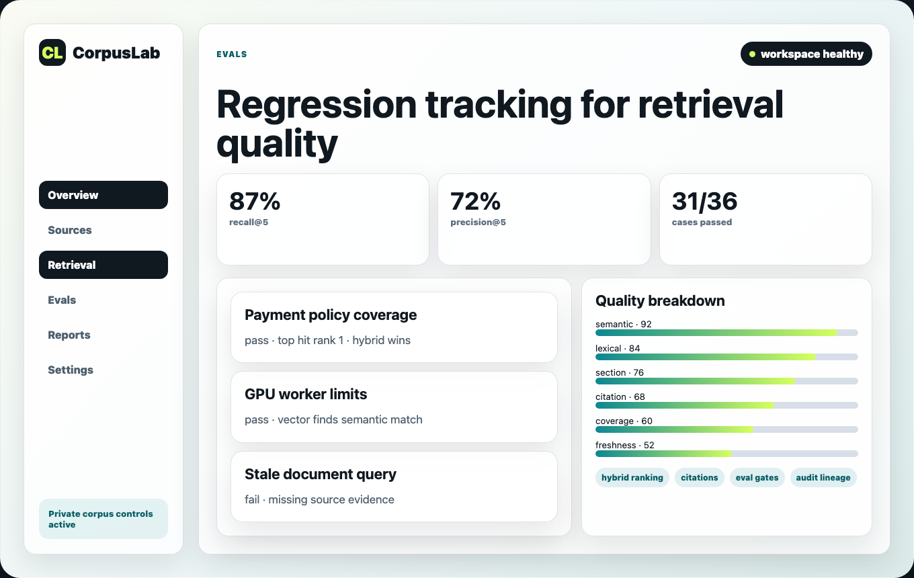
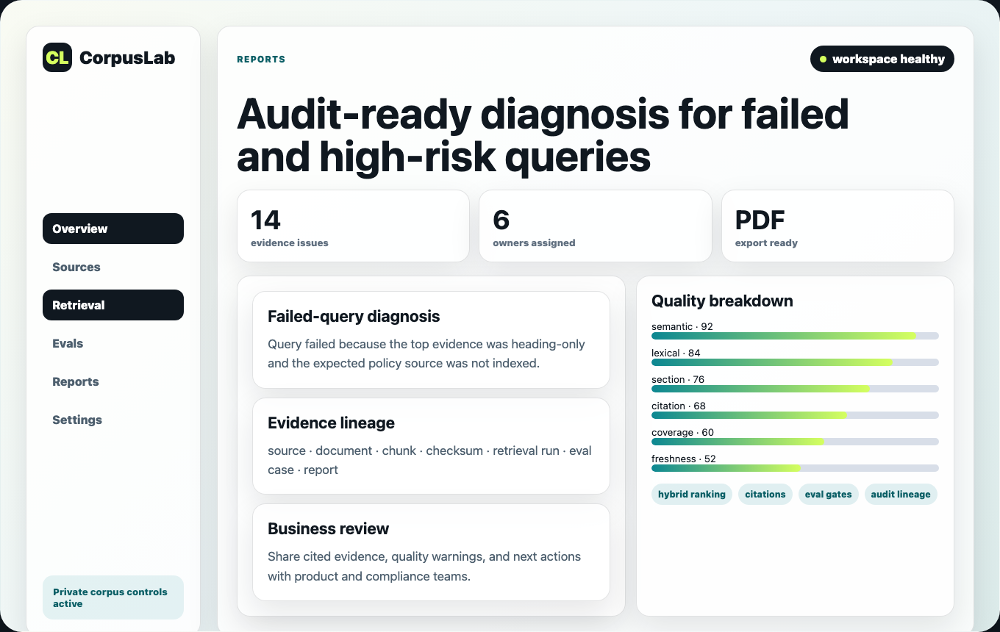
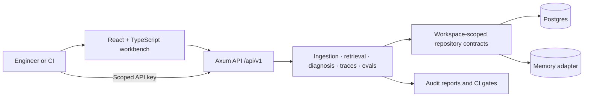

# CorpusLab

**Local-first RAG debugging and corpus observability for teams that need to understand why retrieval works—or fails.**

[](https://github.com/MuneebHoda/RAG-Debugger/actions/workflows/ci.yml)
[](https://github.com/MuneebHoda/RAG-Debugger/actions/workflows/coverage.yml)
[](https://github.com/MuneebHoda/RAG-Debugger/actions/workflows/cargo-deny.yml)
[](https://github.com/MuneebHoda/RAG-Debugger/actions/workflows/dependency-review.yml)

CorpusLab turns retrieval runs into inspectable evidence, deterministic failure labels, regression tests, and privacy-classified reports. It brings ingestion, chunking, retrieval, tracing, evaluation, and release gates into one workbench so engineers can improve RAG quality without sending raw corpus data to a hosted model.



> [!IMPORTANT]
> CorpusLab is public pre-release software. `main` receives best-effort security support, but APIs and compatibility may evolve before a stable release.

## Contents

- [Why CorpusLab](#why-corpuslab)
- [How It Works](#how-it-works)
- [Product Tour](#product-tour)
- [Capabilities](#capabilities)
- [Architecture](#architecture)
- [Privacy and Security](#privacy-and-security)
- [Getting Started](#getting-started)
- [Using CorpusLab](#using-corpuslab)
- [Evaluation in CI](#evaluation-in-ci)
- [Technology and Repository Layout](#technology-and-repository-layout)
- [Development and Quality](#development-and-quality)
- [Documentation](#documentation)
- [Contributing and Security](#contributing-and-security)

## Why CorpusLab

A plausible answer can still be grounded in the wrong chunk, weak evidence, or a stale index. Aggregate retrieval scores rarely explain why a system failed, and raw traces are difficult to compare consistently across changes.

CorpusLab is built for engineers, ML practitioners, and technical teams who need to answer concrete questions about a retrieval-augmented generation system:

- What documents and chunks were retrieved?
- Why did those chunks rank where they did?
- Which lexical, semantic, phrase, section, path, or metadata signals affected ranking?
- Did the answer cite strong evidence that directly supports it?
- Did duplicate evidence, weak chunks, missing embeddings, or bad chunk boundaries influence the result?
- Did a retrieval or configuration change improve known questions—or introduce a regression?

Instead of treating observability, evaluation, and reporting as separate systems, CorpusLab keeps them connected through one evidence lineage: source → document → chunk → retrieval run → trace → evaluation → report.

## How It Works

**Ingest → Index → Retrieve → Diagnose → Trace → Evaluate → Report**

| Stage        | What CorpusLab does                                                                                                                  |
| ------------ | ------------------------------------------------------------------------------------------------------------------------------------ |
| **Ingest**   | Extracts text from supported files, builds document profiles, and records extraction and chunk-quality warnings.                     |
| **Index**    | Generates local embeddings for persisted chunks and explicitly reports missing or stale index state.                                 |
| **Retrieve** | Runs lexical, vector, or hybrid retrieval with ranked evidence, citations, matched terms, and score breakdowns.                      |
| **Diagnose** | Separates answer support from retrieval quality and assigns deterministic evidence and retrieval failure labels.                     |
| **Trace**    | Saves the retrieval timeline, ranked chunks, citations, warnings, and rerun comparisons for later inspection.                        |
| **Evaluate** | Runs expected-evidence datasets across retrieval modes and calculates recall, precision, MRR, citation coverage, latency, and gates. |
| **Report**   | Produces workspace-owned audit snapshots with explicit privacy modes and controlled Markdown export.                                 |

The current implementation is local-first: ingestion, embeddings, retrieval, traces, evaluations, and reports run against the configured CorpusLab instance and its private storage boundary.

## Product Tour

| Corpus intelligence                                                                                                                                                                 | Retrieval diagnosis                                                                                                                                                                                |
| ----------------------------------------------------------------------------------------------------------------------------------------------------------------------------------- | -------------------------------------------------------------------------------------------------------------------------------------------------------------------------------------------------- |
|                        |                                        |
| **Inspect the corpus before debugging the answer.** Review detected document profiles, structured chunks, extraction warnings, duplicate status, quality flags, and evidence hints. | **See why evidence ranked.** Compare lexical, vector, and hybrid modes while inspecting matched terms, normalized score components, evidence strength, citations, and answer-support diagnosis.    |
| Evaluation                                                                                                                                                                          | Audit reports                                                                                                                                                                                      |
|                              |                                                     |
| **Turn debugging sessions into regression coverage.** Build expected-evidence datasets, run cross-mode experiments, inspect failed cases, and apply deterministic release gates.    | **Make failures reviewable without losing provenance.** Generate reports from traces, experiments, or CI runs; retain evidence lineage; and export only when the selected privacy mode permits it. |

## Capabilities

### Corpus Intelligence

- Upload `.txt`, `.md`, `.markdown`, `.html`, `.htm`, and embedded-text `.pdf` files through the workbench.
- Choose structured chunking for section-aware splits or a whitespace baseline for comparison.
- Inspect document type, extraction quality, warnings, token and byte ranges, section titles, split reasons, checksums, text density, evidence hints, duplicate status, and chunk-quality flags.
- Preserve extracted chunks in Postgres while discarding the original uploaded binary after in-memory processing.
- Load the versioned sample corpus through an additive, idempotent guided demo that does not reset existing workspace data.

### Retrieval Diagnosis

- Build local chunk embeddings and inspect indexed, missing, or stale embedding status.
- Query in lexical, vector, or hybrid mode, with optional source or document filtering.
- Inspect semantic, lexical, phrase, section, path, and metadata ranking signals alongside normalized scores and matched terms.
- Review citations, duplicate suppression, evidence strength, weak-candidate warnings, and separate answer-support and retrieval-quality indicators.
- Surface explicit missing-index failures instead of silently degrading vector or hybrid retrieval to lexical search.

### Trace Debugger

- Save retrieval runs as workspace-owned traces with the query, ranked evidence, citations, failure labels, and timeline spans.
- Reopen traces without losing the evidence and ranking context that produced the diagnosis.
- Rerun the same trace with lexical, vector, or hybrid retrieval and a different `top_k` value.
- Compare primary issues, secondary candidate warnings, evidence coverage, and ranked results across reruns.

### Eval Lab and Release Gates

- Create golden datasets and expected-evidence cases manually or directly from Retrieval and Trace workflows.
- Run experiments across lexical, vector, and hybrid modes.
- Measure recall@k, precision@k, MRR, citation coverage, latency p50/p95, and case-level outcomes.
- Detect missing evidence, wrong chunks, low precision, weak evidence, missing embeddings, heading-only evidence, and duplicate evidence with deterministic labels.
- Persist pass/fail gates, regression details, revision metadata, failed cases, and CI-run history.

### Audit Reports

- Generate immutable report snapshots from saved traces, Eval Lab experiments, or CI evaluation runs.
- Preserve source, document, chunk, checksum, retrieval, evaluation, and report lineage.
- Default report creation to `metadata_only`; allow approved snippets only when explicitly selected.
- Keep `full_local_only` reports readable inside the workbench while rejecting Markdown export.
- Copy or download exportable Markdown for engineering, product, or compliance review.

### Authentication and Workspace Isolation

- Use local signup and login backed by opaque HttpOnly session cookies.
- Require an authenticated workspace context for protected workbench APIs.
- Enforce workspace ownership in both API handlers and storage repositories so foreign and nonexistent resources share the same sanitized response behavior.
- Create scoped API keys for CI evaluation; show each secret once, store only its hash, and support revocation.
- Keep database URLs, passwords, secret material, and deployment internals out of the browser-visible runtime configuration.

## Architecture



| Layer              | Responsibility                                                                                                                |
| ------------------ | ----------------------------------------------------------------------------------------------------------------------------- |
| **Web workbench**  | User workflows, authenticated server state, accessible diagnostics, reports, and evaluation views.                            |
| **Axum API**       | Versioned `/api/v1` routes, typed validation and errors, authentication, request limits, and redacted telemetry.              |
| **Core contracts** | Shared projects, sources, chunks, retrieval, trace, evaluation, report, configuration, and privacy types.                     |
| **RAG behavior**   | Extraction, structured chunking, document intelligence, embeddings, retrieval, evidence diagnosis, tracing, and eval scoring. |
| **Storage**        | Workspace-scoped repository contracts with in-memory and Postgres adapters.                                                   |

Public probes remain available at `/healthz` and `/readyz`. Product APIs are versioned under `/api/v1` and return a stable typed error envelope; internal storage and infrastructure details are not exposed to clients.

See [Architecture](docs/architecture.md), [Frontend Architecture](docs/frontend-architecture.md), and the repository [ADRs](docs/adr) for the complete boundaries and design history.

## Privacy and Security

Privacy is part of the product model, not an optional deployment add-on.

| Data class                       | Current handling                                                                                        |
| -------------------------------- | ------------------------------------------------------------------------------------------------------- |
| Uploaded files                   | Processed in memory; original browser-uploaded binaries are not persisted.                              |
| Extracted chunks and embeddings  | Treated as sensitive derived data and stored inside the configured local/private database boundary.     |
| Queries, answers, and traces     | Kept local by default and prohibited from logs, telemetry, and public artifacts.                        |
| Sessions and API keys            | Sessions use opaque HttpOnly cookies; API-key secrets are shown once and stored only as hashes.         |
| Reports                          | Created with explicit `metadata_only`, `snippets_allowed`, or `full_local_only` privacy classification. |
| Cross-workspace resource lookups | Rejected at repository boundaries without revealing whether a foreign identifier exists.                |

CorpusLab v1 does not call a hosted embedding or generation provider. Safe diagnostics use opaque IDs, counts, statuses, durations, deterministic failure labels, aggregate metrics, and approved checksum prefixes—not raw corpus or query content.

Before using real private data, review [Privacy and Security](docs/privacy-security.md), [Logging and Redaction](docs/logging-redaction.md), the [Privacy Review Checklist](docs/privacy-review-checklist.md), and [SECURITY.md](SECURITY.md).

## Getting Started

### Prerequisites

- Rust stable via `rustup`, including `rustfmt` and Clippy
- Node.js 24 or newer
- Docker Desktop or another Docker daemon
- [`just`](https://github.com/casey/just)

Postgres runs through Docker for the standard local workflow. The SQLx CLI is needed only for manual migration authoring and commands; see the [Development Guide](docs/development.md).

### 1. Clone and install

```sh
git clone https://github.com/MuneebHoda/RAG-Debugger.git
cd RAG-Debugger
cp .env.example .env
npm --prefix apps/web ci
```

### 2. Create the local bootstrap password

```sh
openssl rand -base64 32
```

Put the generated value after `RAG_DEBUGGER_BOOTSTRAP_PASSWORD=` in `.env`. Keep the configured bootstrap email or replace it with another local address.

> [!CAUTION]
> `.env` is ignored by Git and must never be committed. Do not reuse the generated password outside this local environment.

### 3. Start Postgres and the API

In the first terminal:

```sh
just db-up
just api
```

`just api` loads the ignored `.env` file and runs Postgres migrations during API startup.

### 4. Start the web app

In a second terminal:

```sh
just web
```

| Service      | URL                                                            |
| ------------ | -------------------------------------------------------------- |
| Web login    | [http://127.0.0.1:5173/login](http://127.0.0.1:5173/login)     |
| API          | [http://127.0.0.1:8080](http://127.0.0.1:8080)                 |
| Health probe | [http://127.0.0.1:8080/healthz](http://127.0.0.1:8080/healthz) |
| Readiness    | [http://127.0.0.1:8080/readyz](http://127.0.0.1:8080/readyz)   |

Sign in with the bootstrap email and password from `.env`, or create a separate local workspace through `/signup`.

### Common setup issues

- If `just db-up` cannot reach Docker, start the Docker daemon and rerun it.
- If the API cannot connect, verify `DATABASE_URL` in the ignored `.env` file and run `just db-migrate`.
- If port `8080` or `5173` is occupied, stop the older API or Vite process before restarting CorpusLab.
- If Cargo is run directly, export the required environment variables first; Cargo does not load `.env` automatically.

> [!WARNING]
> `docker compose down -v` deletes the Postgres volume and all local CorpusLab data. It is not a routine troubleshooting command.

## Using CorpusLab

The Home page includes a six-step guided workflow:

1. **Load the demo corpus.** Add a versioned sample source through the same ingestion path used by uploaded documents.
2. **Inspect Sources.** Review profiles, chunks, warnings, quality flags, and duplicate evidence.
3. **Index embeddings.** Build local embeddings and confirm that no chunks are missing or stale.
4. **Run retrieval.** Ask the suggested query in hybrid mode and inspect ranked evidence, citations, and the diagnosis.
5. **Save a trace.** Preserve the result and compare a rerun with another mode or `top_k`.
6. **Evaluate and report.** Save expected evidence, run an experiment, and create a metadata-only audit report.

Loading the demo is additive and idempotent: it does not reset existing workspace data. Follow the [Guided Demo](docs/guided-demo.md) for the complete walkthrough.

For real data, start with these workflow guides:

- [File Ingestion](docs/file-ingestion.md)
- [Retrieval Playground](docs/retrieval-playground.md)
- [Trace Debugger](docs/trace-debugger.md)
- [Eval Lab](docs/eval-lab.md)
- [RAG Audit Reports](docs/rag-audit-reports.md)

## Evaluation in CI

CorpusLab can run an existing Eval Lab dataset from GitHub Actions and fail the job when its configured gate fails. CI authentication uses a workspace-scoped API key with the `ci_eval_runs` scope.

The example workflow is intentionally explicit about what is evaluated:

- It requests an evaluation from the CorpusLab instance configured by `CORPUSLAB_API_URL`.
- It records branch, commit SHA, and configuration label as run metadata.
- It does **not** automatically execute or evaluate the pull request's modified RAG application code.
- Pull requests targeting the same unchanged CorpusLab instance and dataset configuration may evaluate the same underlying system state.
- Candidate-specific evaluation requires CorpusLab to use a candidate-specific deployment, corpus/index, or retrieval configuration.

See [CI Evaluation Workflows](docs/ci-eval-workflows.md) and the [example GitHub Actions workflow](docs/examples/github-actions-corpuslab-evals.yml) for API-key setup, required variables, gate behavior, and failure handling.

## Technology and Repository Layout

### Technology

| Area          | Current implementation                                                                                           |
| ------------- | ---------------------------------------------------------------------------------------------------------------- |
| Backend       | Rust, Axum, Tokio, typed domain errors, and versioned JSON APIs                                                  |
| RAG engine    | Structured extraction and chunking, local embeddings, lexical/vector/hybrid retrieval, deterministic diagnostics |
| Persistence   | Postgres with SQLx migrations plus an in-memory adapter for focused development and testing                      |
| Web           | React, TypeScript, Vite, TanStack Query, route-level feature modules, and CSS modules                            |
| Testing       | Rust unit/integration tests, Postgres contract tests, Vitest and Testing Library, and Playwright                 |
| Quality gates | Formatting, Clippy, ESLint, typechecking, builds, coverage, Cargo Deny, dependency review, and governance checks |

### Repository layout

```text
apps/
  api/       Axum API, auth, config, telemetry, and HTTP routes
  web/       React, Vite, and TypeScript public site and workbench
crates/
  core/      Shared domain contracts, config, and privacy types
  rag/       Extraction, chunking, embeddings, retrieval, tracing, and evals
  storage/   Repository traits plus memory and Postgres adapters
docs/        Architecture, product, development, privacy, and testing guides
migrations/  Forward-only SQLx migrations
```

## Development and Quality

Run the standard local gate while developing:

```sh
just check
```

Run the release-equivalent gate before a milestone or migration-heavy pull request:

```sh
just full-check
```

| Gate              | Coverage                                                                                                                                            |
| ----------------- | --------------------------------------------------------------------------------------------------------------------------------------------------- |
| `just rust-check` | Rust formatting, Clippy with warnings denied, workspace tests, and workspace build                                                                  |
| `just web-check`  | Prettier, TypeScript typechecking, ESLint, Vitest, and the production web build                                                                     |
| `just check`      | Governance checks plus the Rust and web gates                                                                                                       |
| `just full-check` | The release gate, adding bundle budgets, Playwright, handbook generation, Postgres migrations, workspace-isolation contracts, and query-plan checks |

Tests live at the lowest useful layer: pure RAG behavior in `crates/rag`, contracts in `crates/core`, persistence in `crates/storage`, handlers in `apps/api`, components in `apps/web`, and complete workbench journeys in Playwright.

Read [Development](docs/development.md), [Testing](docs/testing.md), and [Engineering Quality](docs/engineering-quality.md) before submitting a change.

## Documentation

| Area                    | Guides                                                                                                                                                                                                                                                      |
| ----------------------- | ----------------------------------------------------------------------------------------------------------------------------------------------------------------------------------------------------------------------------------------------------------- |
| **Use CorpusLab**       | [Guided Demo](docs/guided-demo.md) · [File Ingestion](docs/file-ingestion.md) · [Retrieval Playground](docs/retrieval-playground.md) · [Trace Debugger](docs/trace-debugger.md) · [Eval Lab](docs/eval-lab.md) · [Audit Reports](docs/rag-audit-reports.md) |
| **Build and test**      | [Development](docs/development.md) · [Architecture](docs/architecture.md) · [Frontend Architecture](docs/frontend-architecture.md) · [Testing](docs/testing.md) · [Engineering Quality](docs/engineering-quality.md)                                        |
| **Privacy and trust**   | [Privacy and Security](docs/privacy-security.md) · [Logging and Redaction](docs/logging-redaction.md) · [Privacy Review](docs/privacy-review-checklist.md) · [Security Policy](SECURITY.md) · [RAG Invariants](docs/rag-invariants.md)                      |
| **Project maintenance** | [Roadmap](docs/roadmap.md) · [Changelog](CHANGELOG.md) · [ADRs](docs/adr) · [Technical Handbook](docs/technical-handbook.md) · [Documentation Maintenance](docs/doc-maintenance.md)                                                                         |

## Contributing and Security

Contributions should be focused, typed, tested, and documented. Read [CONTRIBUTING.md](CONTRIBUTING.md) for setup, quality gates, commit expectations, and pull-request conventions. Agent-assisted changes must also follow [AGENTS.md](AGENTS.md).

Do not report vulnerabilities in public issues. Follow the private reporting process in [SECURITY.md](SECURITY.md), and never include credentials or private corpus, query, trace, or report content in a vulnerability report.

CorpusLab remains public pre-release software. Follow the [roadmap](docs/roadmap.md) for current project direction and the [changelog](CHANGELOG.md) for completed milestones.
