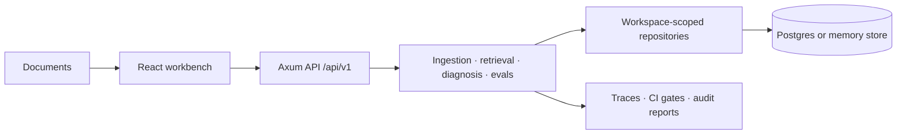

# CorpusLab

**Local-first RAG debugging and corpus observability for teams that need to understand why retrieval works—or fails.**

[](https://github.com/MuneebHoda/RAG-Debugger/actions/workflows/ci.yml)
[](https://github.com/MuneebHoda/RAG-Debugger/actions/workflows/coverage.yml)
[](https://github.com/MuneebHoda/RAG-Debugger/actions/workflows/cargo-deny.yml)
[](https://github.com/MuneebHoda/RAG-Debugger/actions/workflows/dependency-review.yml)

CorpusLab turns retrieval runs into inspectable evidence, deterministic failure labels, regression tests, and privacy-classified reports. It brings ingestion, chunking, retrieval, tracing, evaluation, and release gates into one workbench so engineers can improve RAG quality without sending raw corpus data to a hosted model.


> [!IMPORTANT]
> CorpusLab is public pre-release software. `main` receives best-effort security support, but APIs and compatibility may evolve before a stable release.

## Why CorpusLab

A plausible answer can still be grounded in the wrong chunk, weak evidence, or a stale index. CorpusLab helps teams answer the questions hidden behind an aggregate retrieval score:

- What documents and chunks were retrieved, and why?
- Which lexical, semantic, phrase, section, path, and metadata signals affected ranking?
- Did the answer use strong, directly supporting evidence?
- Where did missing embeddings, duplicate evidence, weak chunks, or bad boundaries appear?
- Did a retrieval change improve or regress known questions?

The working loop is deliberately simple:

**Ingest → Index → Retrieve → Diagnose → Trace → Evaluate → Report**

## What You Can Do

- **Understand the corpus:** ingest text, Markdown, HTML, and embedded-text PDFs; inspect structured chunks, document profiles, extraction warnings, duplicates, and quality flags.
- **Debug retrieval:** compare lexical, vector, and hybrid search with score breakdowns, matched terms, evidence strength, citations, and deterministic answer-support checks.
- **Trace failures:** save retrieval runs, inspect ranked evidence and failure labels, then rerun with a different retrieval mode or `top_k`.
- **Protect quality:** build expected-evidence datasets, compare retrieval modes, track regressions, and run Eval Lab gates from CI.
- **Create reviewable reports:** turn traces, experiments, and CI runs into metadata-only or explicitly approved snippet reports with Markdown export.
- **Keep work isolated:** use local authentication, workspace-scoped storage, hashed API keys, and repository-enforced authorization boundaries.

## Architecture At A Glance



Raw documents, extracted chunks, embeddings, queries, traces, and reports remain inside the configured local or private storage boundary. Uploaded file bytes are processed in memory rather than stored as original binaries. See [Privacy and Security](docs/privacy-security.md) for the complete data-handling model.

## Quick Start

### Prerequisites

- Rust stable with `rustfmt` and Clippy
- Node.js 24 or newer
- Docker Desktop or another Docker daemon
- [`just`](https://github.com/casey/just)

### Install

```sh
git clone https://github.com/MuneebHoda/RAG-Debugger.git
cd RAG-Debugger
cp .env.example .env
openssl rand -base64 32
npm --prefix apps/web ci
```

Put the generated value after `RAG_DEBUGGER_BOOTSTRAP_PASSWORD=` in `.env`. The file is ignored by Git and must never be committed; `.env.example` intentionally contains no password.

### Run

Start Postgres and the API in the first terminal:

```sh
just db-up
just api
```

Start the web app in a second terminal:

```sh
just web
```

Open [http://127.0.0.1:5173/login](http://127.0.0.1:5173/login) and sign in with the bootstrap email from `.env` and the password you generated. The API is available at [http://127.0.0.1:8080](http://127.0.0.1:8080).

The API loads the ignored `.env` file through `just api` and runs Postgres migrations during startup. If you run Cargo directly, export the required environment variables first because Cargo does not load `.env`.

### Try The Guided Demo

After signing in, follow the six-step checklist on Home to load the versioned sample corpus, index it, run a suggested query, inspect the trace, and export a metadata-only audit report. Loading the demo is additive and never resets existing workspace data.

See the [Guided Demo](docs/guided-demo.md) for the full walkthrough and troubleshooting guide.

## Repository Layout

```text
apps/
  api/       Axum API, auth, config, telemetry, and HTTP routes
  web/       React, Vite, and TypeScript public site and workbench
crates/
  core/      Shared domain contracts, config, and privacy types
  rag/       Extraction, chunking, embeddings, retrieval, tracing, and evals
  storage/   Repository traits plus memory and Postgres adapters
docs/        Architecture, feature, development, privacy, and testing guides
migrations/  Forward-only SQLx migrations
```

## Development And Quality

Run the fast local gate while developing:

```sh
just check
```

Run the release-equivalent gate before a milestone or migration-heavy pull request:

```sh
just full-check
```

The full gate adds bundle budgets, Playwright coverage, handbook generation, Postgres migrations, workspace-isolation contracts, and query-plan checks. Focused commands such as `just rust-check` and `just web-check` are documented in the [Development Guide](docs/development.md).

## Documentation

| Area              | Guides                                                                                                                                                                                                                                                      |
| ----------------- | ----------------------------------------------------------------------------------------------------------------------------------------------------------------------------------------------------------------------------------------------------------- |
| Use CorpusLab     | [Guided Demo](docs/guided-demo.md) · [File Ingestion](docs/file-ingestion.md) · [Retrieval Playground](docs/retrieval-playground.md) · [Trace Debugger](docs/trace-debugger.md) · [Eval Lab](docs/eval-lab.md) · [Audit Reports](docs/rag-audit-reports.md) |
| Build and test    | [Development](docs/development.md) · [Architecture](docs/architecture.md) · [Frontend Architecture](docs/frontend-architecture.md) · [Testing](docs/testing.md) · [Engineering Quality](docs/engineering-quality.md)                                        |
| Privacy and trust | [Privacy and Security](docs/privacy-security.md) · [Logging and Redaction](docs/logging-redaction.md) · [Security Policy](SECURITY.md) · [RAG Invariants](docs/rag-invariants.md)                                                                           |
| Project status    | [Roadmap](docs/roadmap.md) · [Changelog](CHANGELOG.md) · [ADRs](docs/adr) · [Technical Handbook](docs/technical-handbook.md)                                                                                                                                |

## Contributing And Security

Contributions should be small, typed, tested, and documented. Read [CONTRIBUTING.md](CONTRIBUTING.md) for setup, quality gates, and pull-request conventions. Agent-assisted changes must also follow [AGENTS.md](AGENTS.md).

Do not report vulnerabilities in public issues. Follow the private reporting process in [SECURITY.md](SECURITY.md), and never include credentials or private corpus, query, trace, or report content in a report.
