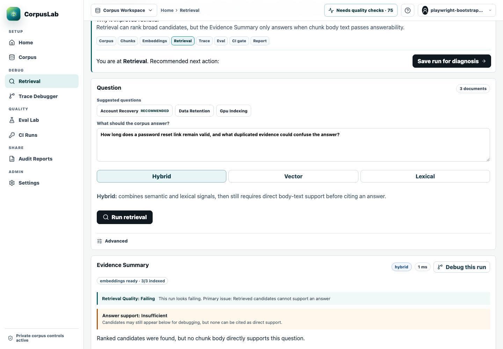
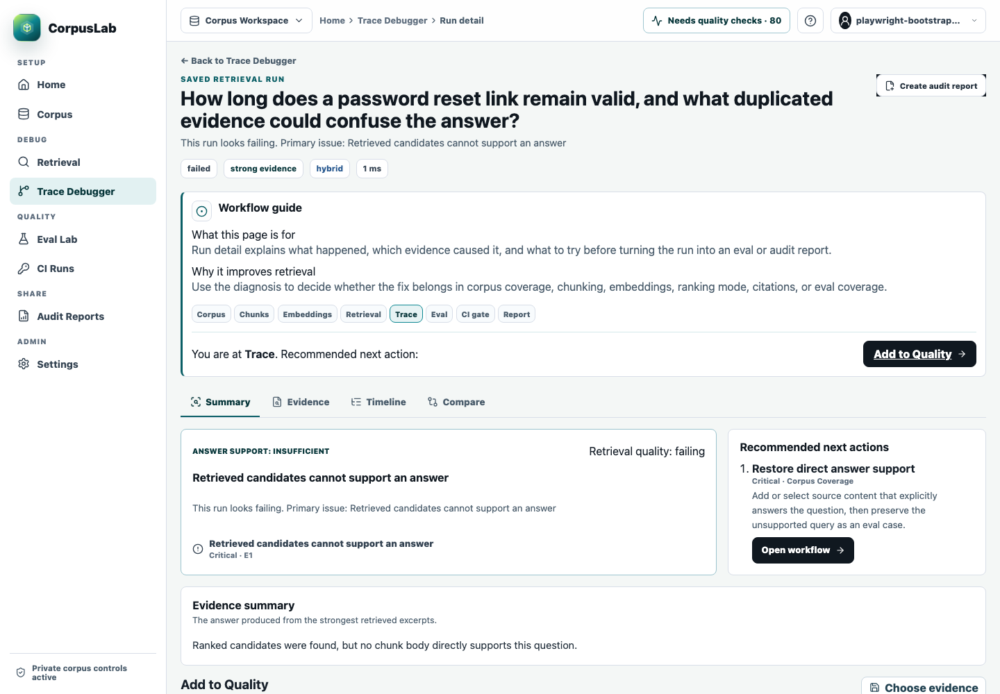
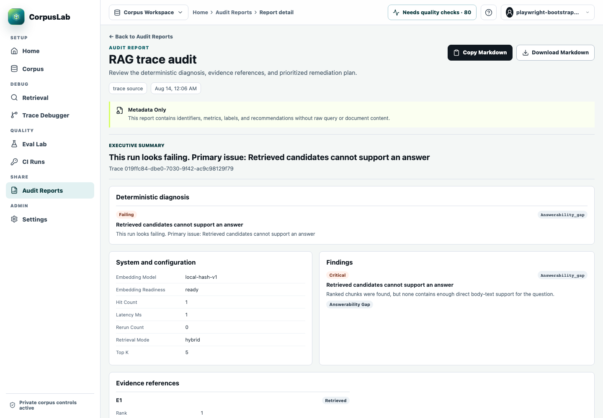

# Design-Partner Demo Script

This script demonstrates the current local-first CorpusLab product with synthetic repository data. It requires no hosted service, external model, or paid API. Allow 10 to 15 minutes for the main walkthrough and another 5 minutes for trace ingestion and CI-gate context.

CorpusLab is a RAG debugging, evaluation, and audit platform for teams building document-based AI systems. The short description is **CI and observability for RAG quality**.

The product loop is:

> Observe a real RAG failure -> inspect its retrieval evidence -> diagnose it -> preserve it as an evaluation -> compare fixes -> prevent regressions through CI.

## Before The Session

Complete the local setup in [Design-Partner Onboarding](design-partner-onboarding.md). Use only the checked-in sample corpus and examples during a recorded or shared demonstration. Never display `.env`, browser storage, API-key secrets, cookies, database URLs, proprietary documents, or a terminal containing unrelated history.

Start CorpusLab from the repository root:

```sh
just db-up
just db-migrate
just api
```

In a second terminal:

```sh
just web
```

Open `http://127.0.0.1:5173/login` and sign in with the local bootstrap email and password from the ignored `.env` file.

## Main Walkthrough

### 1. Load The Deterministic Corpus

1. Open **Home**.
2. Choose **Load sample corpus**.
3. Explain that loading is additive and idempotent. It creates or repairs the versioned `CorpusLab Guided Demo` project and never resets existing workspace data.
4. Choose **Index sample**. This indexes only the sample source with the local embedding provider.

Expected result: Home shows the corpus, chunks, and embeddings steps as complete. The sample contains three synthetic Markdown documents for account recovery, data retention, and GPU indexing.

### 2. Run Retrieval And Inspect Evidence

1. Choose **Test recommended query**.
2. On **Retrieval**, open **Advanced** and confirm **CorpusLab Sample Corpus** is selected.
3. Choose **Run retrieval**.
4. In **Evidence Summary**, point out the answerability status, citations, and diagnosis.
5. In ranked evidence, show rank, score signals, matched terms, quality flags, and whether each candidate directly supports an answer.

Explain the invariant: retrieval may expose broad candidates for debugging, but the answerability gate cites only body text that directly supports the question. Unsupported candidates remain visible instead of being turned into an answer.



### 3. Save And Diagnose The Trace

1. Choose **Debug this run**.
2. On the trace detail page, review **Summary**, **Evidence**, and **Timeline**.
3. Explain the outcome, primary diagnosis, failure labels, affected evidence, and recommended next actions.
4. Open **Compare**, choose another retrieval mode or `top_k`, and choose **Run comparison**.

Expected result: the trace preserves the original ranked evidence and shows deterministic before/after score, rank, citation, latency, and diagnosis changes.



### 4. Create A Privacy-Permitted Audit Report

1. Return to **Summary**.
2. Choose **Create audit report**.
3. Keep the default privacy mode, `metadata_only`, and choose **Create report**.
4. Review the executive summary, findings, evidence references, failure labels, and prioritized recommendations.
5. Show **Copy Markdown** and **Download Markdown**.

Explain that metadata-only output excludes query text, document paths, section titles, and snippets. `full_local_only` reports remain visible locally but cannot be copied or downloaded.



### 5. Preserve The Failure In Eval Lab

1. Return to the trace and choose **Add to Quality**.
2. Select **Default retrieval dataset**, or create a focused dataset under **Eval Lab** first.
3. Choose **Choose evidence**.
4. Select an exact expected chunk when that chunk must be retrieved. Select a document-level expectation only when any suitable chunk from that document is acceptable.
5. Save the quality case.
6. Open the dataset in **Eval Lab**, choose lexical, vector, and hybrid modes, and choose **Run experiment**.
7. Run the same dataset again with the same modes and `top_k`, then open the experiment detail and select the earlier compatible baseline. To demonstrate a meaningful change, deliberately adjust the synthetic corpus, index, or expected evidence before the second run.

Expected result: the experiment leads with gate status and displays recall, precision, MRR, citation coverage, latency, failed cases, failure labels, and regression classification. A compatible baseline uses the same dataset, `top_k`, and sorted mode set.

For a deliberate failure demonstration, save a case whose expected evidence is not returned for the query. Label it clearly as a synthetic negative case; do not misrepresent it as a product benchmark.

### 6. Show The Failed CI Gate

Use an ordinary local Eval Lab dataset. Do not use a case derived from a `full_local_only` imported trace; the server intentionally rejects those datasets from CI.

1. Open **Settings -> API keys**.
2. Create a **GitHub Actions** key and copy its one-time secret to a secure local shell variable. Do not display it in a recording.
3. Configure the checked-in workflow at [`docs/examples/github-actions-corpuslab-evals.yml`](examples/github-actions-corpuslab-evals.yml), or run it from a private test repository whose runner can reach the local CorpusLab API.
4. Use the deliberately failing ordinary dataset and `fail_on_gate=true`.
5. Open **CI Runs** at `/app/evals?view=ci-runs` and inspect the failed gate, revision metadata, metric deltas, newly failing cases, and report action.

Expected result: CorpusLab persists the run and returns HTTP `422` when the release gate fails. The example workflow prints only aggregate gate status, recall, failed-case count, opaque IDs, and configuration label. It does not print the response body.

The workflow evaluates the configured CorpusLab instance and dataset. It does not automatically execute a pull request's changed RAG application. See [CI Eval Workflows](ci-eval-workflows.md) for candidate-specific setup requirements.

## Import An External Trace

### Native JSON

In **Settings -> API keys**, select **Trace ingestion**, create a key, and copy the current project ID. Set the non-secret values, then enter the key through a silent prompt so it does not appear in shell history:

```sh
export CORPUSLAB_API_URL=http://127.0.0.1:8080
export CORPUSLAB_PROJECT_ID='the project UUID shown in Settings'
read -r -s CORPUSLAB_API_KEY
export CORPUSLAB_API_KEY
printf '\n'
./scripts/ingest-trace-example.sh
```

Open **Trace Debugger**. The `native-demo-001` import should show a failed native trace, one weak ranked evidence item, its mapping status, permitted configuration, and ingestion limitations. Repeating the command updates the same trace identity.

### OTLP/HTTP

The checked-in Python example emits a synthetic retrieval/generation span tree and does not call a model:

```sh
python3 -m venv .venv
. .venv/bin/activate
pip install -r examples/trace-ingestion/python/requirements.txt
python examples/trace-ingestion/python/basic_ingest.py
```

The Collector path is documented in [Local Trace Ingestion](trace-ingestion.md). OTLP v1 accepts uncompressed HTTP protobuf only; OTLP JSON, gzip, and gRPC are not supported.

## Explain The Three Import Modes

| Mode               | Retained                                                                                | Downstream boundary                                                                                 |
| ------------------ | --------------------------------------------------------------------------------------- | --------------------------------------------------------------------------------------------------- |
| `metadata_only`    | Structural IDs, timing, status, ranks, scores, citations, and safe configuration        | Cannot create a reproducible imported Eval case; metadata report only                               |
| `snippets_allowed` | Metadata plus explicitly supplied bounded evidence snippets                             | Cannot create a reproducible imported Eval case; metadata or approved-snippet report                |
| `full_local_only`  | Explicit bounded local query, prompt, answer, labels, span names, and evidence snippets | May create a provenance-locked local Eval case; cannot enter CI, reports, Markdown, copy, or export |

OTLP imports are always `metadata_only`. Native import privacy cannot exceed the project's privacy policy. Imported traces cannot be rerun because only the originating application can reproduce their execution safely.

## Close The Demo

Re-state the product loop and ask the partner where their current workflow loses evidence lineage: production trace capture, chunk diagnosis, repeatable evaluation, CI enforcement, or reviewable reports. Use [Design-Partner Feedback](design-partner-feedback.md) to record only sanitized findings.

See [Known Limitations](known-limitations.md) before discussing deployment, hosted access, framework integrations, or enterprise controls.

## Screenshot Provenance

The three screenshots in this guide were captured at `1440x1000` from the real workbench on the issue #30 branch, using the memory-backed API, checked-in `corpuslab-guided-demo-v1` fixtures, the repository's test-only identity, and reduced motion. The capture followed login, sample loading, local indexing, the recommended retrieval, trace creation, and metadata-only report creation. The images were visually inspected at full resolution and contain no API key, cookie, password, database value, proprietary content, browser extension, or unrelated desktop content.
